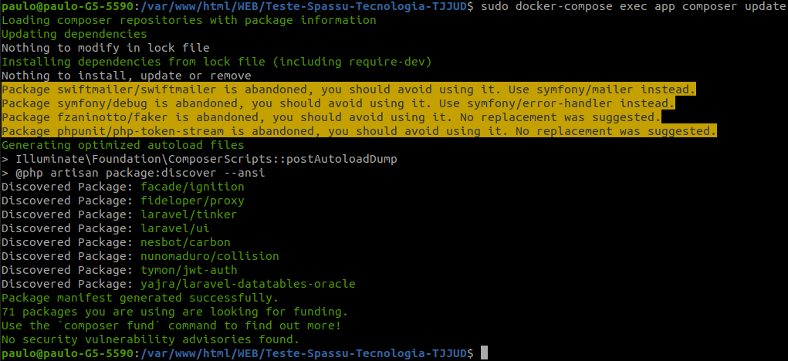

# Teste-Desenvolvimento-Spassu

---
## Subindo o Docker para rodar o app
1. **sudo docker-compose build app**
2. **sudo docker-compose up -d**
3. 

---
## Instalar as dependências do composer
4. **sudo docker-compose exec app composer install**
5. 
6. **sudo docker-compose exec app composer update**
---

## crie uma chave para o artisan
7. **sudo docker-compose exec app php artisan key:generate**
8. 
---

## Obtendo o host do mysql que o Docker gerou caso queira acompanhar no worbench ou outro SGDB

Comando no terminal:

9. **sudo docker ps**

10. 

11. **sudo docker inspect _id do mysql_**

12. 

13. Copie o numero do IPAddress 
* Ex:  _192.168.224.4_
* Database: Spassu
* Username: Spassu_user
* Password: Spassu2024

## Gere as Tabelas
14. Rode o Migrate **sudo docker-compose exec app php artisan migrate:refresh --seed**
15. 
---

16. Acesse o **_http://localhost:8000/_**
17. 

---

18. Crie seu usuario e realize o login 
19. 

